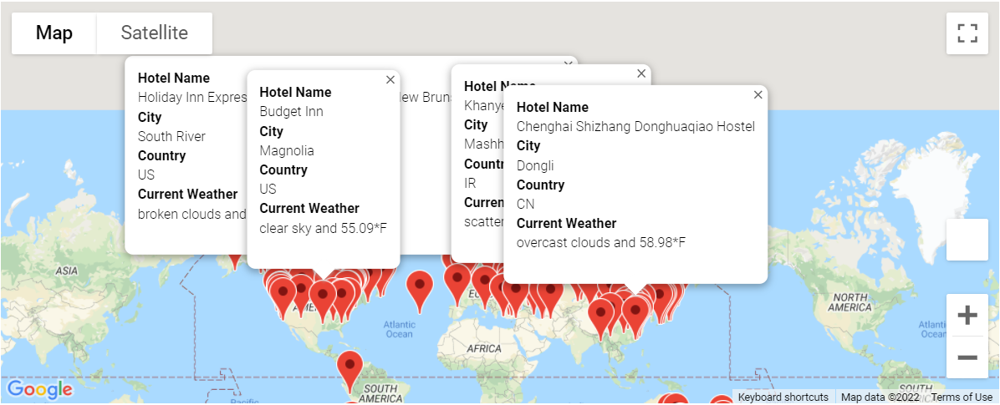

# World_Weather_Analysis
## Project Outline
1) Collect and analyze weather data across cities worldwide
2) PlanMyTrip app will use the data to recommend ideal hotels based on clients' weather preferences.
3) 500 or more of the world's unique cities and their weather data in real time. 
  * Collect data from OpenWeatherMap API and Googlemaps API
  * Create Exploratory Analysis with Visualization
  * Visualize Travel Data

## Results
### Deliverable 1: Retrieve Weather Data

 Weather_Database folder contains the following files :

  * [Weather_Database.ipynb](Weather_Database/Weather_Database.ipynb)
  * [WeatherPy_Database.csv](Weather_Database/WeatherPy_Database.csv)
  
  * **A Glimpse of the csv file output** 
  
  
### Deliverable 2: Create a Customer Travel Destinations Map

Vacation_Search folder contains the following files :
  * [Vacation_Search.ipynb](Vacation_Search/Vacation_Search.ipynb)
  * [WeatherPy_vacation.csv](Vacation_Search/WeatherPy_vacation.csv)
  
  * **WeatherPy_vacation_map.png** - Display the weather heat maps with markers
  
 
 ### Deliverable 3: Create a Travel Itinerary Map
 Vacation_Itinerary folder contains the following files :
  * [Vacation_Itinerary.ipynb](Vacation_Iternary/Vacation_Itinerary.ipynb)
  
  * **WeatherPy_travel_map.png** - Displays the travel route
   
   
   
  * **WeatherPy_travel_map_markers.png** - Display the markers of the travel route. 
   

  * **Additional image showing route and markers together** - It was observed that when we add route only single marker is visible and the format of the marker changes.
  
